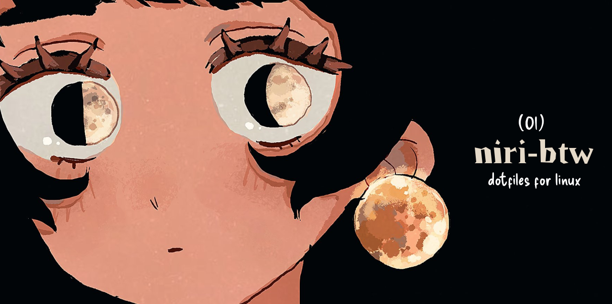
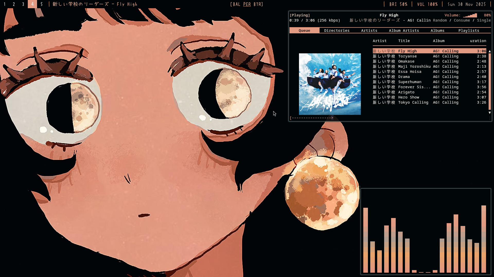
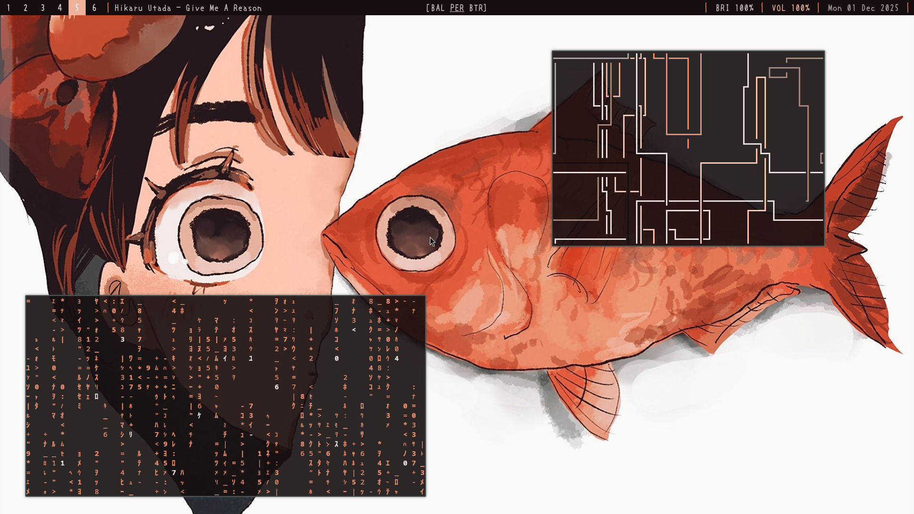
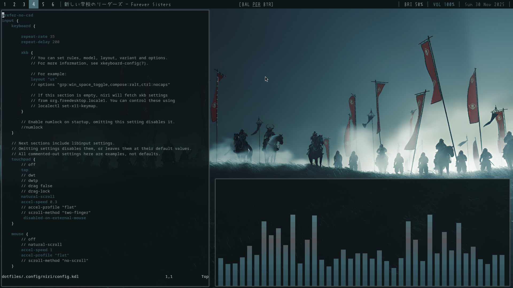
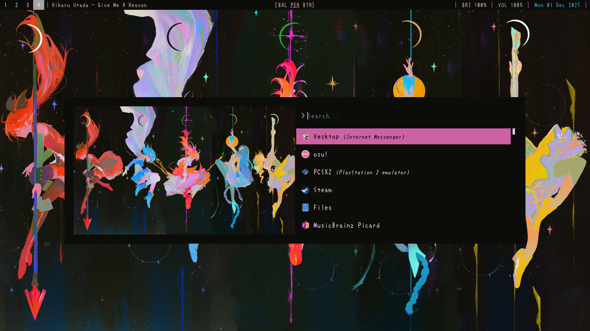
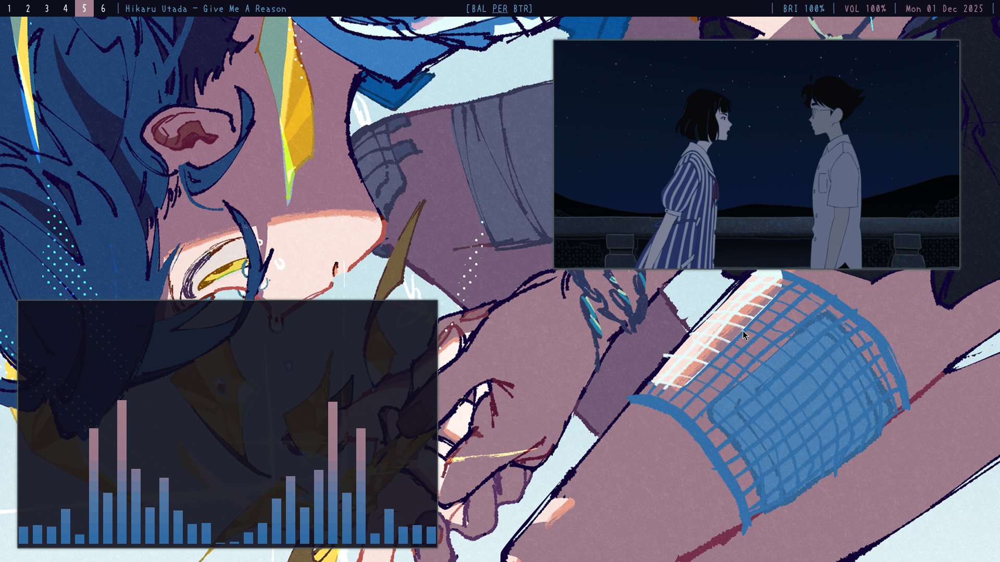
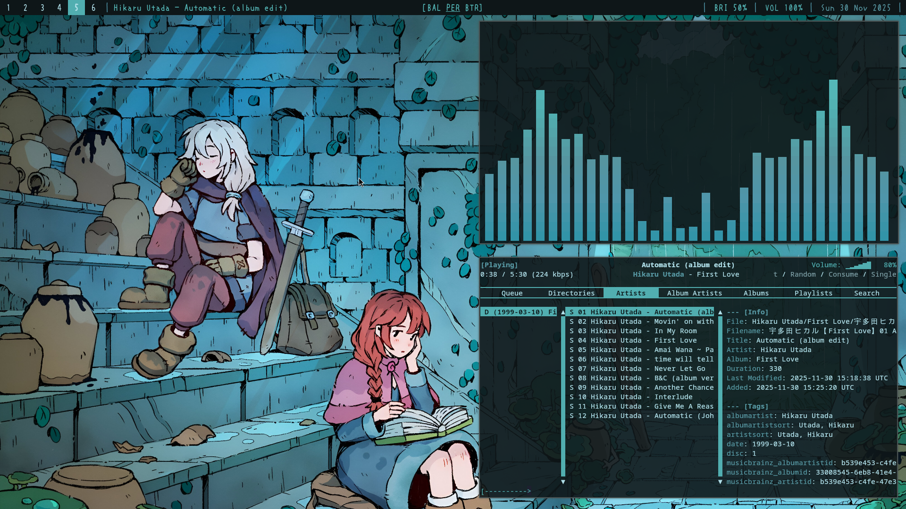

<h1 align="center">Niri Btw ✨ </h1>
<div align="center">
Niri setup for my old laptop with dynamic themes and shit.
</div>

<br><div align="center">
  
</div><br>

## 🛠️ Stuff I use 

- **niri** 
- **waybar**
- **rofi** 
- **kitty** 
- **pywal** 
- **fastfetch** 

> [!IMPORTANT]
> Remove the pywal line from all the configs to use your own themes.


## 📸 Some Screenshots

<!--  -->



<div align="center">
  <table>
    <tr>
      <td align="center"></td>
      <td align="center"></td>
    </tr>
    <tr>
      <td align="center"></td>
      <td align="center"></td>
    </tr>
  </table>
</div>

## 📦 How to Install

### Prerequisites

Install the required font:
- [Uzura Font](https://fontsgeek.com/fonts/uzura_font-regular)(its for the waybar and rofi)

### Setup

Clone the repository:
```bash
git clone https://github.com/isthatelitho/niri-btw.git
cd niri-btw
```

Copy configuration files to their respective locations:
```bash
cp -r .config/* ~/.config/
```
Give perms to scripts with:
```bash
chmod +x path/to/scripts/
```


## 🎨 Customization

Add your wallpapers to `~/Pictures/walls/` and press **Mod+N** to cycle through them.

Pywal will automatically generate and apply color schemes to waybar, rofi, kitty, btop, nvim and cava. 

